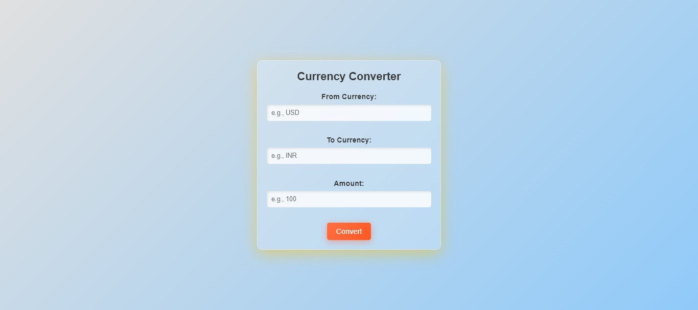

# Project Report: Currency Converter Using C++ with CGI (Backend)

## Abstract
This project implements a simple currency converter using **C++** as the backend and **HTML** for the frontend, connecting them through the **Common Gateway Interface (CGI)**. The application converts amounts between different currencies based on predefined exchange rates, enabling dynamic user interaction via a web browser.

---

## Objectives
- To develop a functional web-based currency converter.
- To integrate C++ backend logic with a web interface using CGI.
- To demonstrate the use of CGI for server-side scripting in a Windows environment.

---


Here is an image from my project:




## Tools and Technologies
- **Programming Language**: C++
- **Web Technologies**: HTML, CGI
- **Server**: Apache (via XAMPP)
- **Compiler**: MinGW (or equivalent)
- **Operating System**: Windows

---

## Features
1. Supports conversion between multiple currencies.
2. User-friendly web interface for input.
3. Fast and lightweight backend processing with C++.
4. Modular design for easy extensibility.

---

## System Architecture
The project comprises two main components:

1. **Frontend**:
   - HTML-based form for user input (source currency, target currency, and amount).
   - Sends data to the backend via a GET request.

2. **Backend**:
   - A CGI script written in C++ that processes user input and performs currency conversion.
   - Returns the result as a dynamically generated HTML page.

---

## Implementation Steps

### Step 1: Environment Setup
1. Install XAMPP to configure Apache server with CGI support.
2. Configure Apache by enabling the CGI module and setting up the `cgi-bin` directory.

### Step 2: Backend Development
1. Write the C++ code for currency conversion logic.
2. Handle CGI queries to process user input and generate dynamic responses.
3. Compile the C++ code into an executable file.

### Step 3: Frontend Development
1. Create an HTML form to capture user input.
2. Use the form's action attribute to call the backend executable.

### Step 4: Integration and Testing
1. Place the compiled executable in the `cgi-bin` directory.
2. Save the HTML file in the `htdocs` directory.
3. Test the application using a web browser.

---

## Code Implementation

### Backend (C++)
**File**: `currency_converter.cpp`
```cpp
#include <iostream>
#include <string>
#include <map>
#include <cstdlib>

void printHTMLHeader() {
    std::cout << "Content-type: text/html\n\n";
    std::cout << "<!DOCTYPE html>\n<html>\n<head>\n<title>Currency Converter</title>\n</head>\n<body>\n";
}

void printHTMLFooter() {
    std::cout << "</body>\n</html>\n";
}

int main() {
    printHTMLHeader();

    std::map<std::string, double> exchangeRates = {
        {"USD_TO_INR", 82.75},
        {"EUR_TO_INR", 89.34},
        {"GBP_TO_INR", 102.56}
    };

    const char* queryString = getenv("QUERY_STRING");
    if (queryString) {
        std::string query(queryString);
        std::string fromCurrency, toCurrency;
        double amount = 0.0;

        size_t fromPos = query.find("from=");
        size_t toPos = query.find("to=");
        size_t amountPos = query.find("amount=");

        if (fromPos != std::string::npos && toPos != std::string::npos && amountPos != std::string::npos) {
            fromCurrency = query.substr(fromPos + 5, toPos - fromPos - 6);
            toCurrency = query.substr(toPos + 3, amountPos - toPos - 4);
            amount = std::stod(query.substr(amountPos + 7));

            std::string key = fromCurrency + "_TO_" + toCurrency;

            if (exchangeRates.find(key) != exchangeRates.end()) {
                double convertedAmount = amount * exchangeRates[key];
                std::cout << "<h1>Converted Amount: " << convertedAmount << " " << toCurrency << "</h1>\n";
            } else {
                std::cout << "<h1>Error: Unsupported currency conversion.</h1>\n";
            }
        } else {
            std::cout << "<h1>Error: Invalid query string.</h1>\n";
        }
    } else {
        std::cout << "<h1>Error: No query string found.</h1>\n";
    }

    printHTMLFooter();
    return 0;
}
```

### Frontend (HTML)
**File**: `index.html`
```html
<!DOCTYPE html>
<html>
<head>
    <title>Currency Converter</title>
    <style>
        /* General Reset */
        * {
            margin: 0;
            padding: 0;
            box-sizing: border-box;
            font-family: Arial, sans-serif;
        }

        /* Body Styling */
        body {
            background: linear-gradient(135deg, #e0e0e0, #90caf9);
            display: flex;
            justify-content: center;
            align-items: center;
            height: 100vh;
        }

        /* Container Styling */
        .container {
            background: rgba(255, 255, 255, 0.2);
            border: 1px solid rgba(255, 255, 255, 0.3);
            box-shadow: 0 8px 32px 0 rgba(31, 38, 135, 0.37);
            backdrop-filter: blur(8px);
            -webkit-backdrop-filter: blur(8px);
            border-radius: 10px;
            padding: 20px;
            width: 400px;
            text-align: center;
        }

        /* Heading Styling */
        .container h1 {
            color: #333;
            margin-bottom: 20px;
            font-size: 24px;
            font-weight: bold;
        }

        /* Form Styling */
        form {
            display: flex;
            flex-direction: column;
            align-items: center;
        }

        label {
            font-size: 16px;
            color: #333;
            margin-bottom: 8px;
            font-weight: bold;
        }

        input {
            width: 100%;
            padding: 10px;
            margin-bottom: 15px;
            border: none;
            border-radius: 5px;
            outline: none;
            background: rgba(255, 255, 255, 0.8);
            box-shadow: inset 2px 2px 5px rgba(0, 0, 0, 0.1);
            font-size: 14px;
        }

        button {
            padding: 10px 20px;
            font-size: 16px;
            background: linear-gradient(135deg, #42a5f5, #1e88e5);
            color: white;
            border: none;
            border-radius: 5px;
            cursor: pointer;
            transition: background 0.3s ease;
        }

        button:hover {
            background: linear-gradient(135deg, #1e88e5, #1565c0);
        }
    </style>
</head>
<body>
    <div class="container">
        <h1>Currency Converter</h1>
        <form action="/cgi-bin/currencyConverter.exe" method="GET">
            <label for="from">From Currency:</label>
            <input type="text" id="from" name="from" placeholder="e.g., USD" required><br>

            <label for="to">To Currency:</label>
            <input type="text" id="to" name="to" placeholder="e.g., INR" required><br>

            <label for="amount">Amount:</label>
            <input type="number" id="amount" name="amount" step="0.01" placeholder="e.g., 100" required><br>

            <button type="submit">Convert</button>
        </form>
    </div>
</body>
</html>

```

---

## Testing
1. Access the executable:
   ```
http://localhost/cgi-bin/currencyConverter.exe
   ```
2. Load the HTML form:
   ```
http://localhost/index.html
   ```
3. Input values and submit the form to verify the results.

---

## Challenges and Solutions
1. **Issue**: Apache not executing CGI scripts.
   - **Solution**: Verify CGI configuration in `httpd.conf` and ensure `.exe` files are allowed.

2. **Issue**: Incorrect query string parsing.
   - **Solution**: Debug using `std::cout` statements and review URL encoding.

---

## Future Enhancements
1. Support for additional currencies.
2. Integration of real-time exchange rates using APIs.
3. Improved UI/UX with CSS and JavaScript.

---

## Conclusion
This project successfully demonstrates the integration of a C++ backend with a web interface using CGI. It highlights the potential of using CGI for lightweight and efficient server-side scripting.


#How to setup:
# Currency Converter Using C++ with CGI (Backend)

This project demonstrates how to build a currency converter using **C++** as the backend and connect it to a web interface via CGI (Common Gateway Interface). Below are the detailed steps to set up, compile, and run the project on a Windows environment using XAMPP.

---

## Prerequisites

- **XAMPP**: Download and install from [https://www.apachefriends.org/](https://www.apachefriends.org/).
- **C++ Compiler**: MinGW or any compatible C++ compiler.
- **Web Browser**: To test the application.

---

## Installation Steps

### Step 1: Install XAMPP
1. Download XAMPP from [https://www.apachefriends.org/](https://www.apachefriends.org/).
2. During installation, ensure **Apache** is selected.

### Step 2: Enable CGI Module in Apache
1. Open the XAMPP control panel and click **Config** for Apache.
2. Select **httpd.conf** to edit the Apache configuration file.
3. Enable the CGI module by uncommenting the following line (remove the `#` if present):
   ```apache
   LoadModule cgi_module modules/mod_cgi.so
   ```
4. Add the following configuration block for the `cgi-bin` directory:
   ```apache
   <Directory "C:/xampp/cgi-bin">
       Options +ExecCGI
       AddHandler cgi-script .cgi .exe
       Require all granted
   </Directory>
   ```
5. Save the file and restart Apache from the XAMPP control panel.

### Step 3: Write and Compile the C++ Code
1. Create a C++ script `currencyConverter.cpp` with your currency conversion logic.

#### Complete Code for `currencyConverter.cpp`
```cpp
#include <iostream>
#include <string>
#include <map>
#include <cstdlib>

void printHTMLHeader() {
    std::cout << "Content-type: text/html\n\n";
    std::cout << "<!DOCTYPE html>\n";
    std::cout << "<html>\n<head>\n<title>Currency Converter</title>\n</head>\n<body>\n";
}

void printHTMLFooter() {
    std::cout << "</body>\n</html>\n";
}

int main() {
    printHTMLHeader();

    std::map<std::string, double> exchangeRates = {
        {"USD_TO_INR", 82.75},
        {"EUR_TO_INR", 89.34},
        {"GBP_TO_INR", 102.56}
    };

    const char* queryString = getenv("QUERY_STRING");
    if (queryString) {
        std::string query(queryString);
        std::string fromCurrency, toCurrency;
        double amount = 0.0;

        size_t fromPos = query.find("from=");
        size_t toPos = query.find("to=");
        size_t amountPos = query.find("amount=");

        if (fromPos != std::string::npos && toPos != std::string::npos && amountPos != std::string::npos) {
            fromCurrency = query.substr(fromPos + 5, toPos - fromPos - 6);
            toCurrency = query.substr(toPos + 3, amountPos - toPos - 4);
            amount = std::stod(query.substr(amountPos + 7));

            std::string key = fromCurrency + "_TO_" + toCurrency;

            if (exchangeRates.find(key) != exchangeRates.end()) {
                double convertedAmount = amount * exchangeRates[key];
                std::cout << "<h1>Converted Amount: " << convertedAmount << " " << toCurrency << "</h1>\n";
            } else {
                std::cout << "<h1>Error: Unsupported currency conversion.</h1>\n";
            }
        } else {
            std::cout << "<h1>Error: Invalid query string.</h1>\n";
        }
    } else {
        std::cout << "<h1>Error: No query string found.</h1>\n";
    }

    printHTMLFooter();
    return 0;
}
```

2. Open a command prompt and navigate to the directory containing `currency_converter.cpp`.
3. Compile the script using MinGW:
   ```bash
   g++ currency_converter.cpp -o currency_converter.exe
   ```
4. Move the compiled file to the `cgi-bin` directory:
   ```bash
   move currency_converter.exe C:/xampp/cgi-bin/
   ```

### Step 4: Create the HTML File
1. Create an HTML file `index.html` with the required form fields for currency conversion.

#### Complete Code for `index.html`
```html
<!DOCTYPE html>
<html>
<head>
    <title>Currency Converter</title>
</head>
<body>
    <h1>Currency Converter</h1>
    <form action="/cgi-bin/currency_converter.exe" method="GET">
        <label for="from">From Currency:</label>
        <input type="text" id="from" name="from" required><br>

        <label for="to">To Currency:</label>
        <input type="text" id="to" name="to" required><br>

        <label for="amount">Amount:</label>
        <input type="number" id="amount" name="amount" step="0.01" required><br>

        <button type="submit">Convert</button>
    </form>
</body>
</html>
```

2. Save the file in the `htdocs` directory of your XAMPP installation:
   ```bash
   C:/xampp/htdocs/index.html
   ```

### Step 5: Test CGI Execution
1. Open your browser and navigate to:
   ```
   http://localhost/cgi-bin/currencyConverter.exe
   ```
2. If properly configured, the output of the CGI script will be displayed.

### Step 6: Connect HTML and C++ (Currency Converter)
1. Load the form in your browser:
   ```
   http://localhost/index.html
   ```
2. Fill in the form fields and submit.
3. The form sends a GET request to `currencyConverter.exe`, processes the request, and returns the result.

---

## Troubleshooting Tips

- Ensure the `cgi-bin` folder is properly configured in `httpd.conf`.
- Ensure the `.exe` file has execution permissions.
- Check Apache error logs for debugging:
  ```
  C:/xampp/apache/logs/error.log
  ```

---

## Commands Summary

### Install XAMPP
```bash
# Download XAMPP from the official site
https://www.apachefriends.org/
```

### Enable CGI in Apache
```bash
# Open Apache configuration
LoadModule cgi_module modules/mod_cgi.so

<Directory "C:/xampp/cgi-bin">
    Options +ExecCGI
    AddHandler cgi-script .cgi .exe
    Require all granted
</Directory>
```

### Compile C++ Code
```bash
# Navigate to the directory containing your script
cd path/to/your/script

# Compile the script
g++ currency_converter.cpp -o currency_converter.exe

# Move the compiled executable to the cgi-bin directory
move currency_converter.exe C:/xampp/cgi-bin/
```

### Run Application
```bash
# Test CGI Execution
http://localhost/cgi-bin/currencyConverter.exe

# Access the HTML Form
http://localhost/index.html
```

---

### Author
Created by **Mr.Brijesh Nishad (Software Developer) **.
